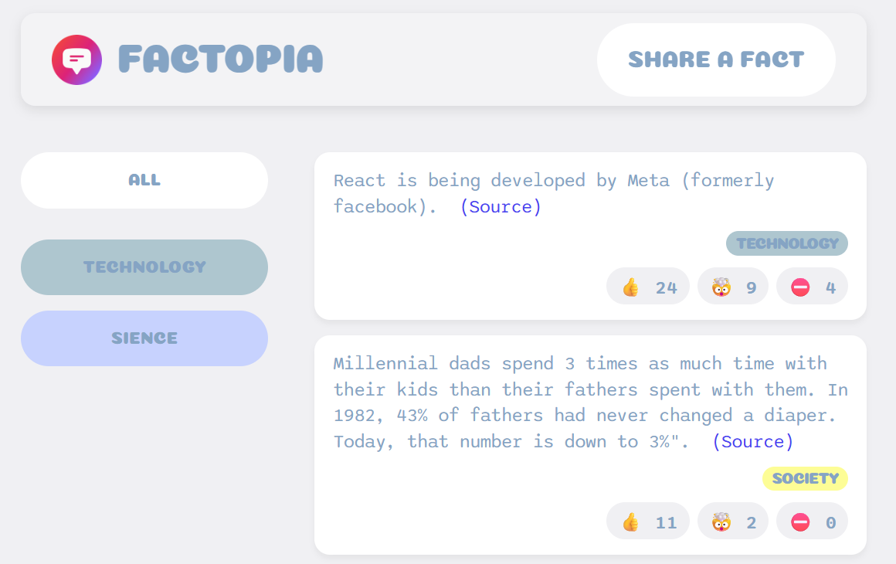

# Factopia

### Content of the course

- HTML
- CSS
- Storing the data in a Supabase database
- JavaScript
- React
- Deploy the app in Netlify/Vercel

### Overview of the functions of the website

- create a new fact and save it in a supabase database
- vote the fact
- sort the facts by categories

### 📷

