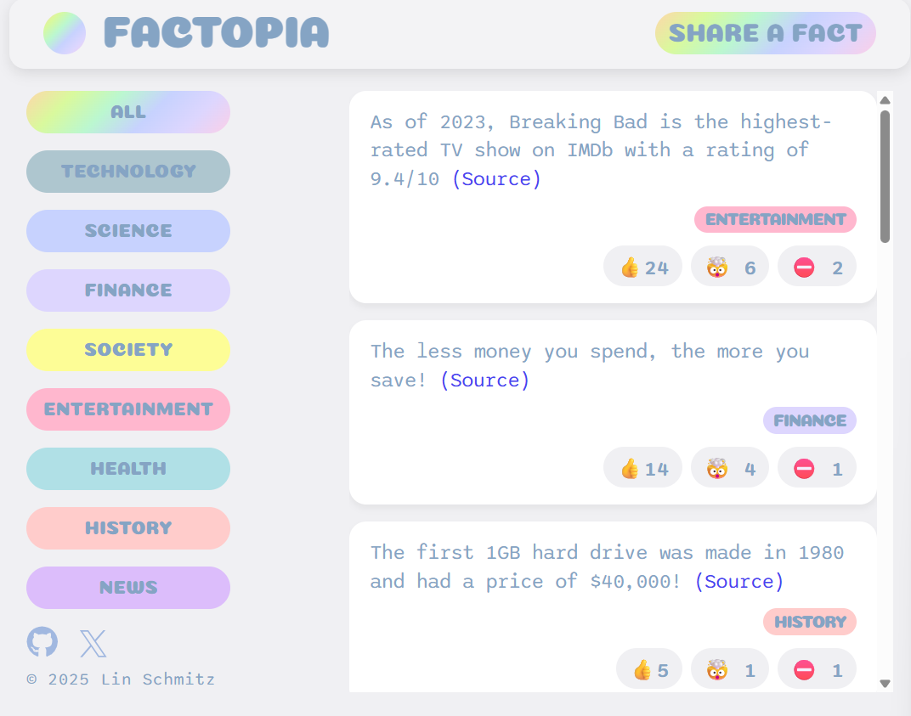

# 📚 Factopia

A simple React app and interactive platform to share and vote on interesting facts — built with **React** and **Supabase**. Users can browse facts, see their sources, and vote on how each fact makes them feel. This project is ideal for learning React fundamentals like components, props, conditional rendering, and working with arrays.

## 🚀 [Live Demo](https://factopia-sch.vercel.app/)

## 🛠️ Tech Stack

- **React**
- **HTML5 & CSS3**

## 📸 Preview



## 📂 Project Structure

```bash
src/
├── App.js         # Main app component
├── components/
│   ├── Header.js
│   ├── NewFactForm.js
│   ├── FactList.js
│   └── CategoryFilter.js
├── data/
│   ├── facts.js
│   └── categories.js
├── index.js       # App entry point
public/
└── img/
    └── logo.png
```

## 🚀 Features

- 📄 **Display facts** from a Supabase database
- 🗳 **Vote** on facts (Interesting, Mind-blowing, or False)
- ➕ **Submit your own facts** using a form with validation
- 🧠 **Filter facts by category**
- 🔄 **Real-time UI updates** after submitting or voting
- 💅 Responsive, clean, and styled with CSS custom properties
- 🔍 Smart logic to show "Disputed" label if fact is controversial
- ⛔ Form is disabled during upload to avoid duplicates

## 📦 Tech Stack

- ⚛️ [React](https://reactjs.org/) (with Hooks)
- 🛠 [Supabase](https://supabase.io/) (as the backend/database)
- 🎨 Custom CSS using CSS variables and responsive grid
- 🌐 Deployed on [Netlify/Vercel/etc.] _(Add your link if deployed)_

---

## 🖼 Categories Available

- 🧪 Technology
- 🧬 Science
- 💰 Finance
- 🧑‍🤝‍🧑 Society
- 🎭 Entertainment
- 🩺 Health
- 🏛 History
- 📰 News

---

## 🧑‍💻 Getting Started

### 1. Clone the repository

```bash
git clone https://github.com/yourusername/factopia.git
cd factopia

###  2. Install dependencies

npm install

### 3. Setup Supabase

Go to supabase.io and create a new project

Create a table named facts with these columns:

Column	Type
id (PK)	integer (auto increment)
text	text
source	text
category	text
votesInteresting	integer
votesMindblowing	integer
votesFalse	integer
createdIn	integer

### Get your Supabase URL and Anon API Key and add them in a supabase.js file:


// supabase.js
import { createClient } from '@supabase/supabase-js';

const supabaseUrl = 'https://your-project-id.supabase.co';
const supabaseKey = 'your-anon-key';
const supabase = createClient(supabaseUrl, supabaseKey);

export default supabase;

### 4. Run the app
npm run dev
# or
npm start

+++++++++++++++
## 📦 Installation

### 5. build project

npm run build


## ✨ Future Improvements


-  🌙 Dark Mode Support
-  📄 Pagination & Lazy Loading
-  🔐 User Authentication
-  📝 User-Generated Content
-  🗳️ One-Vote-Per-User Enforcement

## 🙌 Acknowledgements

- Inspired by early React practice projects.
- Facts from reliable sources listed in each item.

Let me know if you want a version in Markdown with styling or a Persian translation.
```
